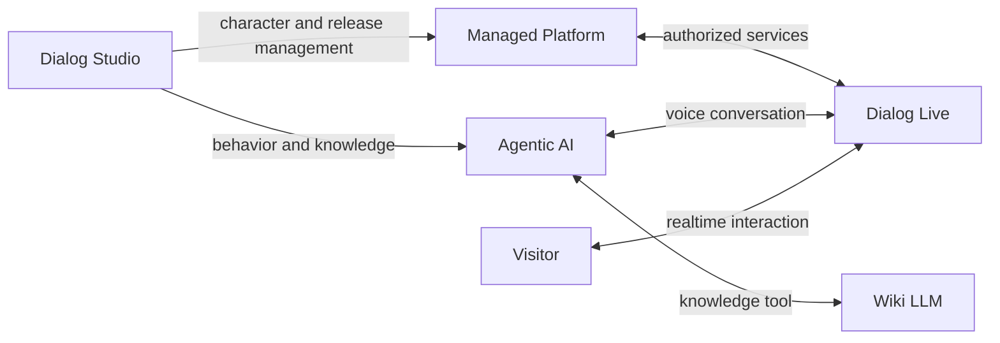
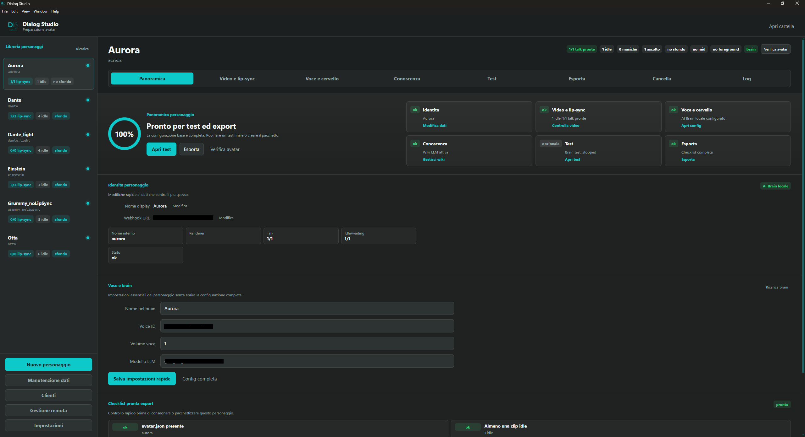
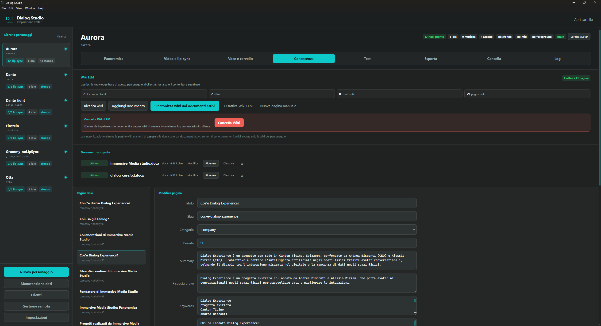
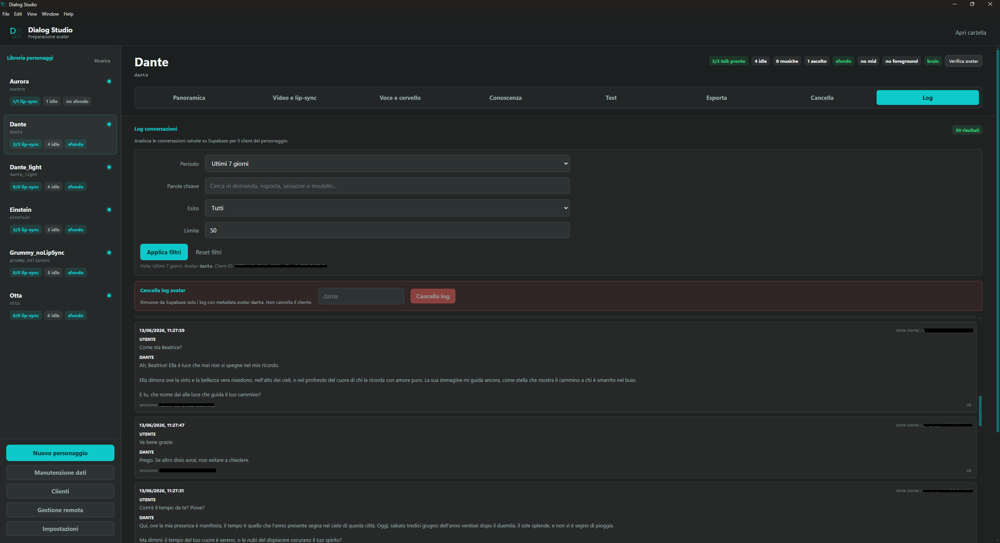
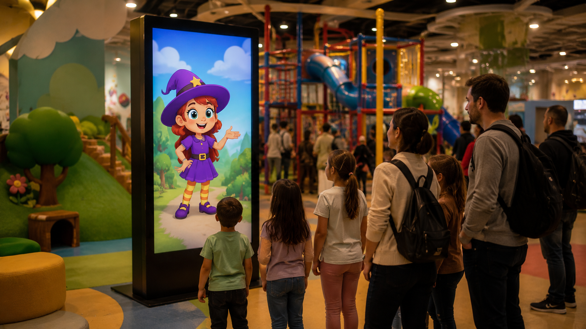

# Dialog Live Showcase

> **Built by me: an end-to-end AI platform for realtime conversational
> characters in physical installations.**

[Official website](https://dialogexperience.com) · Operational across multiple
client projects · Selected for **ElevenLabs Grants**

Dialog Live combines agentic AI, voice interaction, custom knowledge memory,
neural character animation, desktop authoring tools, and managed remote
infrastructure.

This repository is a case study. The commercial product is
proprietary and its production code is intentionally not published.

## Product Preview

<table>
  <tr>
    <td width="50%" align="center">
      
    </td>
    <td width="50%" align="center">
      
    </td>
  </tr>
  <tr>
    <td align="center"><strong>Idle experience</strong></td>
    <td align="center"><strong>Speech-driven neural animation</strong></td>
  </tr>
</table>

Generated speech and facial motion are coordinated at runtime. Responses are
not selected from a library of complete pre-recorded videos.

## At A Glance

| | |
| --- | --- |
| **Product maturity** | Operational with multiple client projects |
| **External recognition** | Selected for ElevenLabs Grants |
| **AI architecture** | Per-character agents with memory and extensible tools |
| **Knowledge** | Custom Wiki LLM memory replacing the earlier RAG approach |
| **Voice** | Speech-to-Text and Text-to-Speech |
| **Visual runtime** | GPU neural inference for realtime lip synchronization |
| **Operations** | Customers, installations, credentials, logs, health, and updates |
| **Delivery** | Desktop authoring, kiosk runtime, thin clients, and managed VPS |

## What I Built

- The overall product architecture and service boundaries
- **Dialog Studio**, the desktop workflow for creating, testing, publishing,
  exporting, and maintaining characters
- A per-character agent architecture with session memory and native tool calling
- An extensible tool contract for knowledge, research, and business integrations
- **Wiki LLM**, a contextual knowledge system designed for realtime,
  multi-customer conversations
- Speech recognition, voice synthesis, and language-aware spoken-text preparation
- A GPU neural pipeline for speech-driven facial animation
- The realtime kiosk lifecycle, including interruption, cancellation, and recovery
- Dedicated VPS services for protected AI, knowledge, authorization, and logging
- Customer, installation, credential, usage, and conversation management
- Packaging, remote updates, deployment automation, cleanup, and diagnostics

## Product Architecture

The diagram is deliberately simplified and does not reproduce the production
topology.

## Core Workstreams

### Dialog Studio

A desktop application that turns a multi-service production process into a
guided workflow for character identity, media, AI behavior, knowledge, testing,
customer assignment, publishing, export, and cleanup.

[Read the Dialog Studio case study](docs/dialog-studio.md)

### Agentic AI

Every character has an independent agent with its own identity, memory, voice,
approved tools, knowledge scope, model preferences, logging, and fallback
behavior. New tools can be integrated behind a shared contract and enabled only
for selected characters.

[Read the agentic AI case study](docs/agentic-ai-platform.md)

### Wiki LLM Memory

The earlier chunk-oriented RAG approach was replaced with topic-oriented,
persistent wiki knowledge. During a conversation, the agent calls a dedicated
tool that searches only the current customer and character scope.

[Read the Wiki LLM case study](docs/wiki-llm-memory.md)

### Realtime Neural Runtime

Generated speech is analyzed by a local GPU neural pipeline and transformed into
character-specific facial animation. Frames are streamed to the application and
coordinated with audio, idle states, transitions, and interruption.

  

[Read the Dialog Live runtime case study](docs/dialog-live-runtime.md)

### Managed VPS Platform

Protected infrastructure runs multi-character agents, Wiki LLM services,
provider integrations, authorization, configuration refresh, logging, usage
attribution, health diagnostics, and remote maintenance. Distributed clients do
not contain server credentials or administrative access.

[Read the managed infrastructure case study](docs/managed-infrastructure.md)

### Data And Remote Operations

The platform models customers, projects, characters, installations, revocable
credentials, knowledge, conversations, usage, and health. Internal tests are
excluded from customer conversation history.

[Read about remote management](docs/remote-platform.md) ·
[Read about data and observability](docs/data-and-observability.md)

## Example Installation Concepts

These are illustrative mockups, not photographs of customer deployments.

## Selected Technologies

| Area | Technologies |
| --- | --- |
| Desktop | React, TypeScript, Vite, Electron |
| Backend | Python, FastAPI, asynchronous services |
| Realtime | WebSocket, browser media APIs, WebGL |
| AI | LLM orchestration, native tool calling, provider adapters |
| Voice | ElevenLabs Speech-to-Text and Text-to-Speech |
| Data | Supabase, PostgreSQL, row-level access control |
| Infrastructure | Dedicated VPS, Docker, reverse proxy, managed Linux services |
| Delivery | GitHub Actions, desktop packaging, thin client releases |
| Media | Neural inference and hardware-accelerated processing |

## Intentionally Not Included

This showcase does **not** contain:

- Production source code or proprietary business logic
- Internal prompts, agent instructions, or production tool schemas
- Real endpoints, network topology, credentials, or deployment commands
- Customer data, configurations, conversations, or production logs
- Provider secrets, private models, or character assets belonging to clients
- Neural preprocessing data, inference implementation, or synchronization logic
- Production timing parameters, performance tuning, or optimization code
- Complete operational workflows that could be used to reproduce the platform

All diagrams, names, interfaces, screenshots, and examples are simplified or
sanitized for portfolio communication.

## Detailed Case Studies

| Document | Focus |
| --- | --- |
| [Dialog Studio](docs/dialog-studio.md) | Character creation, testing, publishing, and export |
| [Agentic AI Platform](docs/agentic-ai-platform.md) | Agents, tools, STT, TTS, memory, and providers |
| [Wiki LLM Memory](docs/wiki-llm-memory.md) | Contextual knowledge and multi-customer isolation |
| [Dialog Live Runtime](docs/dialog-live-runtime.md) | Realtime interaction and neural animation |
| [Managed Infrastructure](docs/managed-infrastructure.md) | VPS services, deployment, and diagnostics |
| [Remote Platform](docs/remote-platform.md) | Customers, installations, credentials, and delivery |
| [Data And Observability](docs/data-and-observability.md) | Logs, usage, health, and access control |

## License And Scope

**All rights reserved. This repository is provided for portfolio review and
technical evaluation only. It is not an open-source distribution of Dialog
Live.**

See [LICENSE.md](LICENSE.md) for the full notice.
