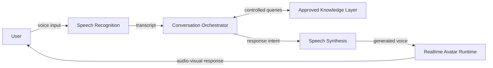
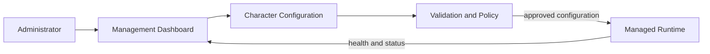
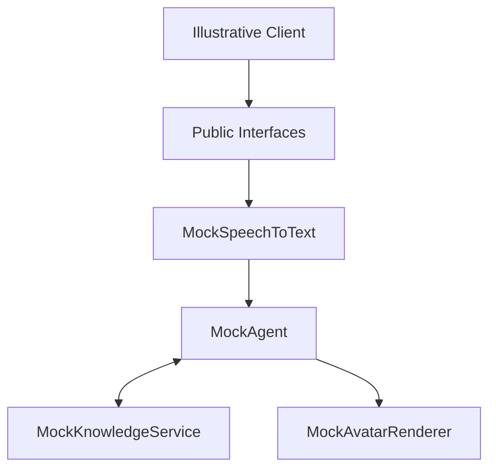

# Dialog Live Showcase

> **Portfolio showcase, not the commercial product.** Dialog Live is a
> proprietary platform. Its production source code and internal documentation
> cannot be published for confidentiality, security, and intellectual-property
> reasons.

Dialog Live is a platform for building interactive digital characters that can
listen, reason over approved information, answer with a voice, and present the
response through a responsive visual experience.

This repository presents the engineering scope, architectural thinking, and
system-design challenges behind the project. Every diagram, interface, service
name, and code example is an intentionally simplified abstraction.

## What Dialog Live Is

Dialog Live turns a voice interaction into a coordinated conversational
experience. It brings together speech processing, AI orchestration, controlled
knowledge access, voice generation, realtime media, configuration tooling, and
operational controls.

The platform is designed for experiences where a generic chat interface is not
enough: exhibitions, cultural venues, branded installations, guided
experiences, education, hospitality, and interactive presentations.

## Key Capabilities

- Voice-first interaction with responsive conversational characters
- Configurable character identity, behavior, voice, and approved knowledge
- Realtime coordination between conversational and visual subsystems
- Multiple deployment profiles for managed installations
- Administrative tooling for configuration and lifecycle management
- Provider-independent service boundaries
- Interruption, recovery, fallback, and operational diagnostics
- Secure separation between customer-facing runtime and protected services

## My Engineering Scope

The work behind Dialog Live includes:

- End-to-end system architecture and service boundaries
- Conversational orchestration and provider abstraction
- Realtime audio and visual interaction lifecycle
- Character configuration and content-management workflows
- Administrative tooling for repeatable setup and delivery
- Deployment, update, diagnostics, and failure-recovery strategies
- Security boundaries for credentials, configurations, and customer data
- Performance work across latency, media quality, and constrained hardware

This showcase focuses on the reasoning behind those responsibilities rather
than the proprietary mechanisms used to implement them.

## System Architecture



The production system has additional security, lifecycle, observability, and
recovery concerns that are deliberately omitted.

## Realtime Interaction Flow

1. The experience captures an explicit user interaction.
2. A speech boundary converts audio into a normalized transcript.
3. The orchestrator combines conversation context with approved capabilities.
4. The knowledge boundary returns only information available to that character.
5. The response is transformed into speech.
6. The visual runtime coordinates presentation and user interruption.
7. Operational signals record health and performance without exposing content.

The exact protocols, buffering strategy, synchronization method, timing
parameters, models, and media pipeline are proprietary and are not represented
here.

## Administration Flow



This separation allows creative configuration to evolve without granting the
client runtime access to protected operational systems.

## Simplified Demo Architecture



The TypeScript files in `src/` exist only to illustrate clean boundaries. They
do not call external services, process real media, contain prompts, or reproduce
production behavior.

## Technology Stack

The commercial platform spans several technology domains:

| Area | Representative technologies |
| --- | --- |
| Experience layer | React, TypeScript, browser media APIs |
| Service layer | Python services, typed configuration, asynchronous processing |
| Communication | Request/response APIs and realtime messaging |
| AI integration | Replaceable speech, language, and knowledge adapters |
| Media runtime | Hardware-accelerated visual processing |
| Operations | Containerized services, managed data, health diagnostics |
| Delivery | Desktop and kiosk-oriented distribution workflows |

This is a capability-level summary, not an inventory of the production stack.

## Design Principles

- **Explicit boundaries:** speech, reasoning, knowledge, voice, and visuals can
  evolve independently.
- **Configuration over forks:** characters share a platform while retaining
  isolated identities and approved capabilities.
- **Latency is experiential:** perceived responsiveness is treated as a product
  concern, not only a backend metric.
- **Interruptibility matters:** realtime experiences must respect changing user
  intent.
- **Protected intelligence:** secrets, prompts, customer configuration, and
  proprietary processing remain outside distributed clients.
- **Observable failure:** health signals and actionable diagnostics are designed
  into the system.
- **Graceful degradation:** dependency failures should lead to controlled
  outcomes rather than broken experiences.

More context is available in [Design Principles](docs/design-principles.md) and
[Realtime Considerations](docs/realtime-considerations.md).

## Example Use Cases

- A historical figure answering visitor questions in a museum
- A branded host welcoming guests at an event or showroom
- A guided character presenting approved educational material
- A multilingual concierge for a public installation
- An interactive spokesperson connected to curated organizational knowledge

These examples describe product categories and do not represent customer
deployments.

## Screenshots

Public-safe screenshots and short product clips will be added after a dedicated
review for customer information, internal controls, file paths, endpoints, and
other sensitive details.

See the [screenshot guidelines](screenshots/README.md).

## Repository Map

```text
dialog-live-showcase/
├── architecture/          # Public-safe diagrams and diagram policy
├── docs/                  # Architecture and engineering case-study notes
├── screenshots/           # Reviewed portfolio media placeholders
├── src/
│   ├── contracts/         # Illustrative interfaces only
│   └── mock-services/     # Non-functional placeholder implementations
├── LICENSE.md
├── SECURITY.md
└── README.md
```

## Portfolio Disclaimer

> This repository is a public showcase of architectural concepts inspired by
> Dialog Live. It does not contain production code, proprietary workflows,
> internal models, customer configurations, or implementation details of the
> commercial platform.

All diagrams, interfaces, names, and examples are illustrative abstractions.
They do not reproduce the production architecture and are not intended to
provide a blueprint for rebuilding the platform.
