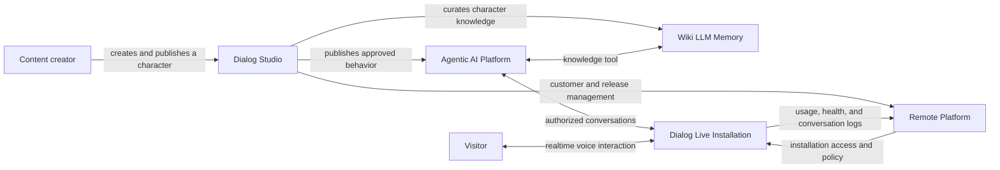
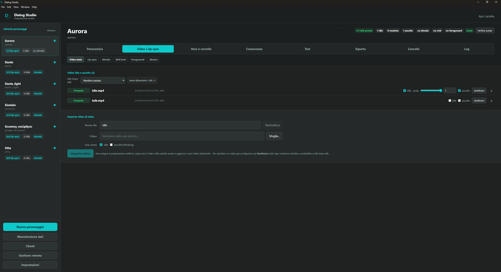
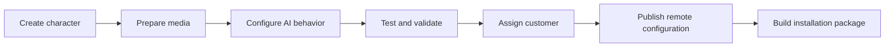
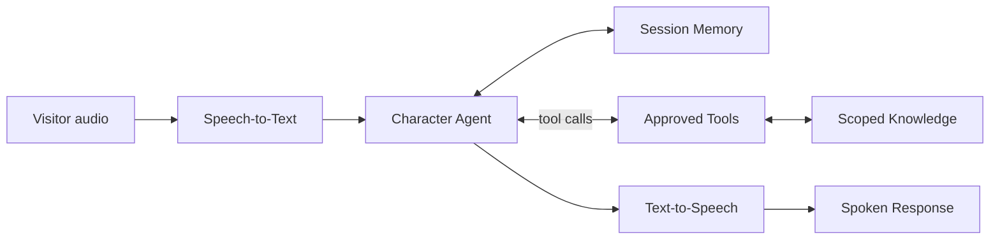
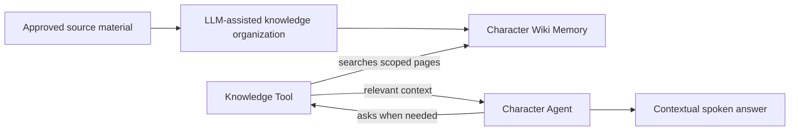
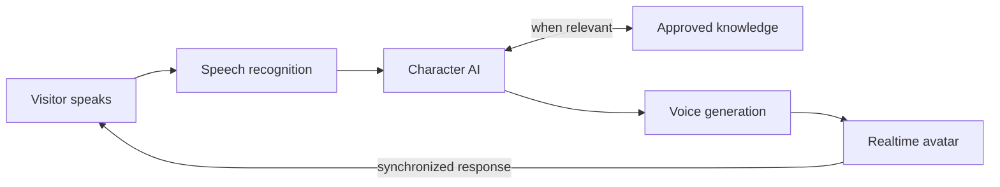
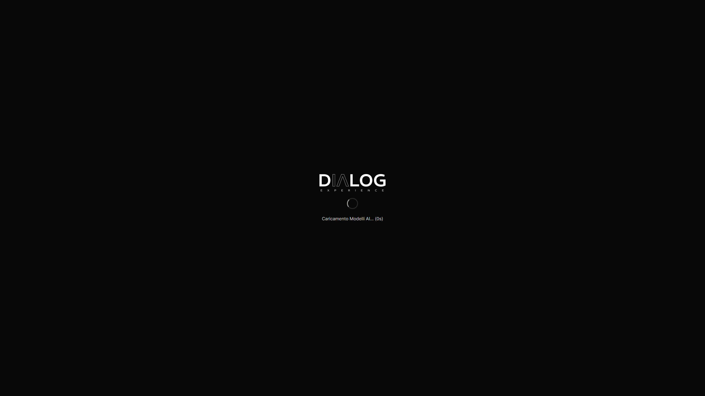
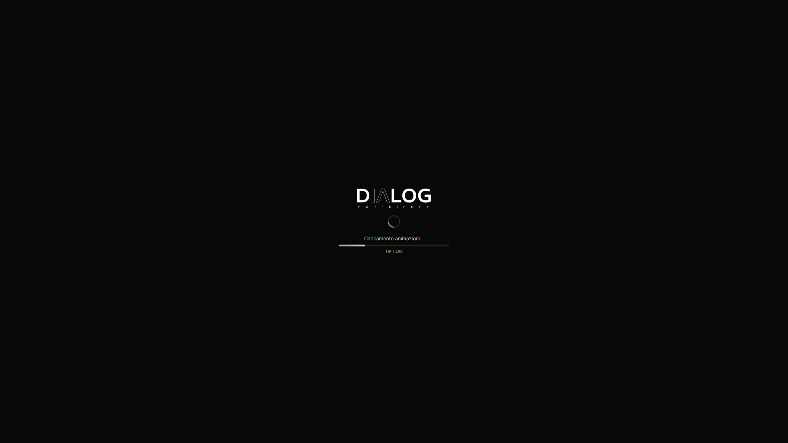
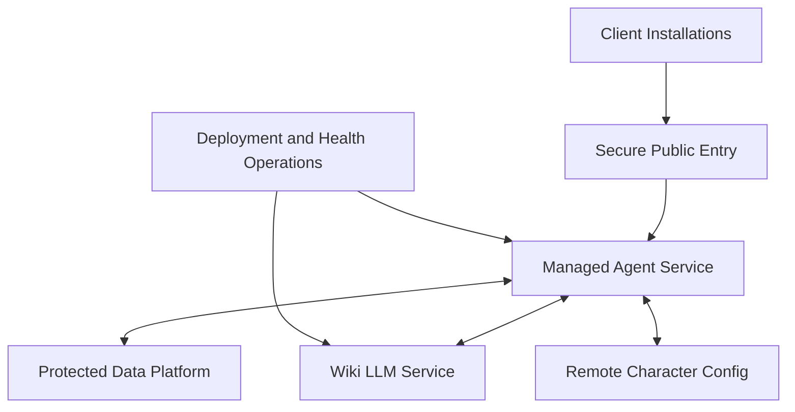
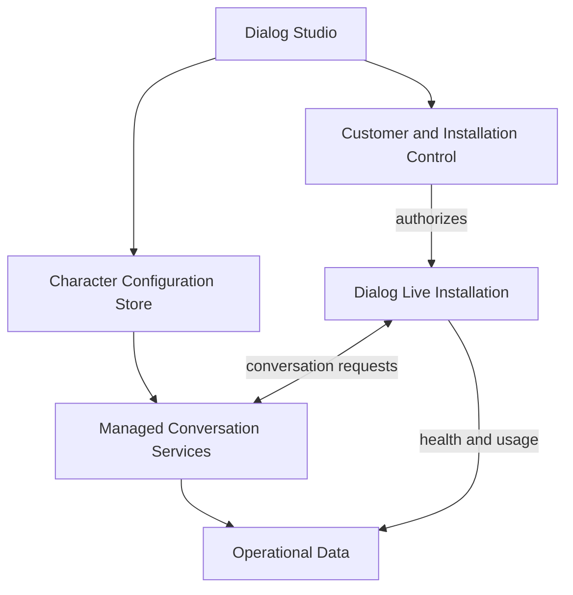

# Dialog Live Showcase

> **This is a portfolio case study, not the Dialog Live product.**
>
> Dialog Live is proprietary software. The production source code, internal
> prompts, customer configurations, deployment procedures, and implementation
> details cannot be published for confidentiality, security, and
> intellectual-property reasons.

Dialog Live is an end-to-end platform for creating, operating, and remotely
managing conversational digital characters.

It is not a prototype or a speculative architecture exercise. Dialog Live is
already operational across multiple client projects and has been selected for
the **ElevenLabs Grants** program.

## Product Preview

<table>
  <tr>
    <td width="50%" align="center">
      
    </td>
    <td width="50%" align="center">
      
    </td>
  </tr>
  <tr>
    <td align="center"><strong>Idle character experience</strong></td>
    <td align="center"><strong>Speech-driven neural animation</strong></td>
  </tr>
</table>

The two images show the same character moving from an idle presentation into a
generated speaking state. The voice response and facial motion are coordinated
at runtime rather than selected from a library of complete recorded answers.

## Designed For Physical Spaces

Dialog Live is designed for installations where a digital character becomes
part of the environment rather than another app on a personal device.

*Illustrative concept: a historical character engaging visitors in a museum or
cultural venue.*

*Illustrative concept: a stylized character creating an interactive experience
for families in an entertainment venue.*

These are concept mockups, not photographs of customer deployments. They show
how the same platform can support different audiences, visual identities,
knowledge domains, and physical contexts.

The project is larger than the avatar visible to the end user. It includes:

1. **Dialog Studio**, a desktop application used to create and configure each
   character.
2. **Dialog Live**, the realtime application experienced by visitors.
3. **An agentic AI platform**, where every character can reason, use approved
   tools, access scoped knowledge, and produce a voice response.
4. **Wiki LLM memory**, a custom knowledge architecture designed for coherent,
   low-latency character answers.
5. **A neural avatar runtime**, which turns generated speech into synchronized
   facial animation.
6. **A managed remote platform**, used to run protected AI services and manage
   configurations, customers,
   installations, access, knowledge, logs, and updates.

This repository explains the engineering work behind those areas without
publishing enough detail to reproduce the commercial platform.

## At A Glance

| Product signal | What it demonstrates |
| --- | --- |
| Operational with multiple clients | The platform has moved beyond prototype validation |
| ElevenLabs Grants participant | External recognition of the voice AI use case |
| End-to-end product ownership | Authoring, AI, realtime media, operations, and delivery |
| Per-character AI agents | Configurable reasoning, tools, knowledge, memory, and voice |
| Custom Wiki LLM memory | Contextual knowledge designed beyond traditional chunk retrieval |
| Neural realtime animation | GPU-accelerated lip synchronization driven by generated speech |
| Dedicated managed infrastructure | Protected AI, knowledge, authorization, logs, and operations |
| Remote customer management | Production lifecycle beyond a single local installation |
| Structured logs and diagnostics | Supportability and operational accountability |

## The Product In One Diagram

The production system contains additional services and security boundaries that
are intentionally omitted.

## 1. Dialog Studio

Dialog Studio turns a complex technical workflow into a guided desktop
experience. It is the control center used before a character reaches a kiosk.

*A character overview brings identity, media readiness, AI configuration,
knowledge, testing, and export status into one operational workspace.*

### What It Handles

- Creating and editing character profiles
- Importing and organizing idle, listening, and speaking media
- Preparing character-specific realtime animation assets
- Configuring voice, language, personality, and approved AI capabilities
- Managing character-specific knowledge sources
- Testing conversation behavior without launching the complete installation
- Validating missing files, incompatible configuration, and incomplete assets
- Publishing protected AI configuration to the remote platform
- Associating characters with customers and installations
- Producing different release packages for local testing and managed delivery
- Updating or removing local and remote character resources

*Dialog Studio manages the visual states and prepared media used by the
realtime character experience.*

The main engineering challenge was not building a form. It was making a
multi-service production process repeatable, validated, and understandable for
someone who should not need to operate the underlying tools manually.

[Read the Dialog Studio case study](docs/dialog-studio.md)

## 2. Agentic AI Platform

Every character has an independent conversational agent rather than sharing one
hard-coded chatbot behavior.

An agent can combine:

- Character identity and behavioral instructions
- Session-aware conversation memory
- Speech-to-text input
- Language-model reasoning
- A character-specific set of approved tools
- Customer and character-scoped knowledge
- Text normalization and natural voice synthesis
- Logging, usage attribution, and fallback behavior

The tool system is extensible. A new capability can be added behind a defined
contract, registered for selected characters, and exposed to the agent without
coupling the core conversation pipeline to one provider or customer workflow.

Examples of tool categories include curated knowledge search, controlled web
research, business-system adapters, and experience-specific actions. The
production tool implementations, prompts, schemas, and orchestration rules are
not published.

[Read the agentic AI case study](docs/agentic-ai-platform.md)

## 3. Wiki LLM Knowledge Memory

Traditional Retrieval-Augmented Generation often treats source material as
independent text chunks selected mainly by similarity. That approach can return
fragments with weak narrative context, duplicate facts, or content that is
difficult for a realtime character to turn into a natural answer.

Dialog Live replaces that earlier approach with a custom **Wiki LLM** memory
layer.

Instead of exposing raw documents to the agent, approved content is organized
into topic-oriented wiki knowledge. At conversation time, a dedicated tool
searches only the knowledge assigned to the current customer and character,
then returns focused context to the agent.

*The Wiki LLM workspace manages source documents and the topic-oriented pages
generated for one character.*

This improves:

- Coherence across related facts
- Suitability for natural spoken answers
- Customer and character isolation
- Knowledge maintenance and targeted cleanup
- Predictability in a realtime interaction
- Reuse of the same agent pipeline across different domains

[Read the Wiki LLM memory case study](docs/wiki-llm-memory.md)

## 4. Dialog Live Runtime

Dialog Live is the visitor-facing application. It coordinates microphone input,
conversation processing, generated speech, character animation, and UI state as
one continuous realtime experience.

### What Happens During An Interaction

The avatar response is not a simple pre-recorded talking video. A local,
GPU-accelerated neural inference pipeline analyzes the generated speech and
renders character-specific lip and facial motion while the response is being
presented.

<table>
  <tr>
    <td width="50%" align="center">
      
    </td>
    <td width="50%" align="center">
      
    </td>
  </tr>
  <tr>
    <td align="center"><strong>Neural runtime initialization</strong></td>
    <td align="center"><strong>Character animation preparation</strong></td>
  </tr>
</table>

The runtime also has to manage:

- Listening, processing, speaking, idle, cancellation, and error states
- User interruption while a response is being produced or presented
- Coordination between audio availability and visual readiness
- Smooth transitions between pre-recorded and generated character states
- Multiple character configurations without product-specific forks
- Local hardware and service startup
- Health checks, recovery, and actionable diagnostics
- Kiosk packaging, updates, and unattended operation

### Multiple Character Experiences

The same runtime architecture supports distinct characters, identities,
knowledge, voices, and visual environments without creating a separate product
fork for each experience.

  

*A second staged character demonstrates the configuration-driven runtime beyond
the Dante example used in the opening preview.*

The proprietary media pipeline, synchronization strategy, timing parameters,
and optimization techniques are not included here.

[Read the Dialog Live runtime case study](docs/dialog-live-runtime.md)

## 5. Managed VPS Platform

Dialog Live uses dedicated managed server infrastructure so commercial
installations do not need to contain provider credentials, AI configuration,
customer administration, knowledge services, or proprietary orchestration.

The VPS environment runs the protected service layer:

- Authorized conversation endpoints for multiple characters
- Per-character brain loading and remote refresh
- Agent orchestration, tools, and provider integrations
- Wiki LLM knowledge services
- Customer and installation validation
- Conversation and usage logging
- Health diagnostics and remote maintenance
- Containerized deployment and controlled service updates

The exact provider, host, network topology, endpoint structure, and deployment
commands are intentionally omitted.

[Read the managed infrastructure case study](docs/managed-infrastructure.md)

## 6. Remote Management

The remote platform separates protected intelligence and administration from
the software delivered to an installation.

It supports:

- Centrally managed character AI configurations
- Remote updates to behavior, voice, capabilities, and approved knowledge
- Customer and project organization
- Individual installation activation, suspension, and optional expiration
- Installation-specific access credentials
- Reusable or revocable credential lifecycle
- Thin client packages that do not contain server secrets
- Remote health and usage visibility
- Removal and maintenance of character resources

[Read about remote management](docs/remote-platform.md)

## Data, Logs, And Observability

Dialog Live uses structured operational data rather than treating every kiosk
as an isolated application.

The platform maintains conceptual records for:

| Area | Purpose |
| --- | --- |
| Customers | Identify the organization receiving the experience |
| Projects and characters | Separate experiences belonging to the same customer |
| Installations | Represent each deployed kiosk independently |
| Access credentials | Authorize, rotate, reuse, or revoke installation access |
| Knowledge content | Scope approved information to the correct customer and character |
| Conversations | Record session context and operational metadata |
| Usage | Attribute service consumption to an installation |
| Health diagnostics | Explain whether logging and dependencies are operating correctly |

Conversation logging is designed to answer practical operational questions:

- Which customer, project, character, and installation handled the interaction?
- Which model and optional capabilities were active?
- Was the request a real visitor interaction or an internal test?
- Did the conversation log successfully?
- Is service usage increasing even if another logging path has failed?
- When did an installation last communicate successfully?

Internal tests are explicitly excluded from customer conversation history.
Sensitive credentials are not stored in logs, and administrative database
access is kept on protected services rather than distributed clients.

*The operational log view supports filtering, support investigation, and
character-scoped lifecycle actions. Identifiers and provider details are
redacted in this portfolio image.*

[Read about data and observability](docs/data-and-observability.md)

## What I Built

My work on Dialog Live spans product engineering, AI systems, media runtime, and
operations:

- Designed the overall architecture and service boundaries
- Built the character creation and management workflow in Dialog Studio
- Built the realtime interaction lifecycle in Dialog Live
- Built a per-character agent architecture with memory and tool calling
- Designed an extensible tool contract for new knowledge and business capabilities
- Replaced the earlier RAG approach with a custom Wiki LLM knowledge memory
- Integrated speech-to-text and text-to-speech into the conversational lifecycle
- Added language-aware voice preparation for more natural spoken output
- Integrated replaceable language, knowledge, speech, and voice providers
- Integrated a GPU neural pipeline for speech-driven character animation
- Designed per-character configuration and remote update behavior
- Built the dedicated VPS service layer for protected AI and knowledge workloads
- Built customer, installation, credential, and release-management workflows
- Implemented structured conversation logging and operational diagnostics
- Designed thin client distribution so protected services remain remote
- Built packaging, update, validation, cleanup, and recovery workflows
- Optimized realtime performance for production hardware

This was an end-to-end product effort: from the visitor interaction to the
desktop authoring tools and the operational systems needed to deliver and
support installations.

## Selected Technologies

| Area | Technologies used |
| --- | --- |
| Desktop applications | React, TypeScript, Vite, Electron |
| Backend services | Python, FastAPI, asynchronous service design |
| Realtime communication | WebSocket and browser media APIs |
| Agentic AI | LLM orchestration, native tool calling, provider adapters |
| Voice AI | ElevenLabs Speech-to-Text and Text-to-Speech |
| Knowledge | Custom Wiki LLM memory and character-scoped tool access |
| Data platform | Supabase, PostgreSQL, row-level access control |
| Remote runtime | Dedicated VPS, Docker, reverse proxy, managed Linux services |
| Delivery | GitHub Actions, desktop packaging, thin client releases |
| Media | Neural inference, WebGL, and hardware-accelerated visual processing |

The table communicates the breadth of the work without acting as a production
dependency manifest or implementation guide.

## From Prototype To Product

The engineering effort also included the work required to move from a promising
demo to a system that can be delivered:

- Repeatable character onboarding instead of hand-built configuration
- Tool-enabled agents instead of fixed question-and-answer scripts
- Structured Wiki LLM memory instead of generic chunk retrieval alone
- Neural speech-driven animation instead of fixed response videos
- Customer and installation isolation
- Protected remote services and thin distributed clients
- Revocable installation access
- Structured conversation and usage attribution
- Health diagnostics for support
- Remote character updates
- Packaging and update workflows
- Cleanup across local and remote resources

These capabilities are now used in operational projects for multiple clients.

## Repository Guide

| Document | What it explains |
| --- | --- |
| [Dialog Studio](docs/dialog-studio.md) | Character creation, testing, validation, publishing, and export |
| [Agentic AI Platform](docs/agentic-ai-platform.md) | Per-character agents, tool calling, STT, TTS, memory, and extensibility |
| [Wiki LLM Memory](docs/wiki-llm-memory.md) | Custom contextual knowledge architecture replacing the earlier RAG approach |
| [Dialog Live Runtime](docs/dialog-live-runtime.md) | Visitor interaction and realtime application responsibilities |
| [Managed Infrastructure](docs/managed-infrastructure.md) | Dedicated VPS responsibilities, protected services, and operations |
| [Remote Platform](docs/remote-platform.md) | Remote brains, customers, installations, credentials, and delivery |
| [Data and Observability](docs/data-and-observability.md) | Database concepts, conversation logs, usage, and health diagnostics |
| [Mock Contracts](src/contracts/index.ts) | Small illustrative interfaces with no production behavior |
| [Screenshot Plan](screenshots/README.md) | Public-safe media still to be reviewed and added |

## Portfolio Disclaimer

> This repository is a public showcase of architectural concepts inspired by
> Dialog Live. It does not contain production code, proprietary workflows,
> internal models, customer configurations, or implementation details of the
> commercial platform.

All diagrams, interfaces, names, and examples are simplified for communication.
They do not reproduce the production architecture and are not intended to
provide a blueprint for rebuilding the platform.
