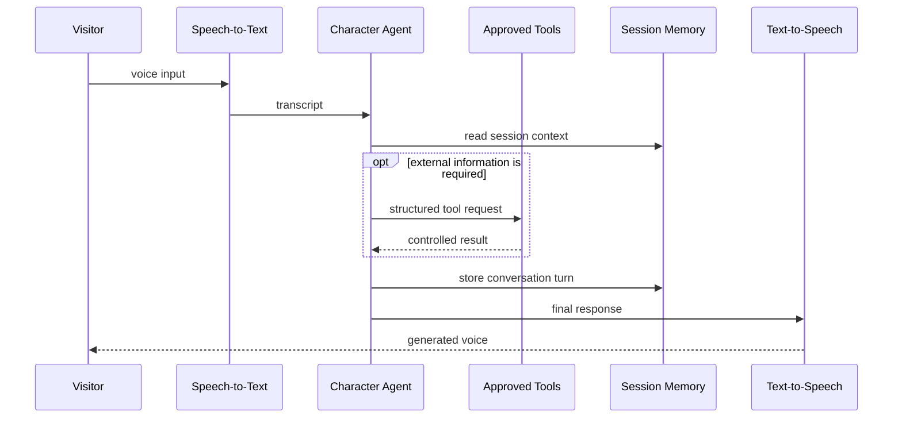

# Agentic AI Platform

Dialog Live uses independent, configurable agents for its characters. The
agentic layer is responsible for turning visitor speech into an appropriate,
grounded, and speakable response.

This is more than a direct prompt sent to a language model. It is a controlled
pipeline with memory, tool execution, knowledge boundaries, voice preparation,
logging, and per-character policy.

## End-To-End AI Flow

The exact models, prompts, schemas, retries, and internal event formats are not
included in this showcase.

## One Agent Per Character

Every character can have its own:

- Behavioral instructions and conversational identity
- Language and voice
- Model preferences
- Memory behavior
- Approved tools
- Knowledge ownership
- Logging attribution
- Error and fallback response
- Remote enabled or disabled state

Shared infrastructure provides the common pipeline, while character
configuration determines what each agent is allowed to know and do.

This avoids both extremes: duplicating the entire platform for every character
or forcing all characters through one generic assistant.

## Agent Tool Calling

Agents can decide when an approved external capability is needed. They issue a
structured request, receive the tool result, and then continue reasoning before
producing the final visitor response.

The system accounts for an important agentic behavior: a model may explain what
it intends to do before requesting a tool. The orchestration layer must preserve
the complete tool request, execute it, and only present content intended as the
final answer.

## Extensible Tool Architecture

Tools implement a shared contract that describes:

- The capability name and purpose
- Structured input accepted from the agent
- Validation of tool arguments
- Asynchronous execution
- A controlled result returned to the agent
- Failure behavior

A new integration can therefore be added as an adapter without rewriting the
core speech and conversation pipeline.

Tool access is configured per character. One agent might use only curated
knowledge, while another can also access controlled research or a
customer-specific business capability.

Illustrative tool categories include:

- Curated knowledge search
- Controlled web research
- Customer content retrieval
- Event or venue information
- Business-system lookups
- Experience-specific actions

The production tools, credentials, prompts, and schemas remain private.

## Speech-To-Text

The speech layer receives a completed visitor utterance and converts it into
text for the agent.

Engineering concerns include:

- Audio format normalization
- Language selection
- Transcription quality in public environments
- Provider failures and timeouts
- Clear separation between recorded audio and conversation logic
- The ability to replace the speech provider behind a stable interface

Dialog Live currently uses ElevenLabs speech technology within this pipeline.

## Text-To-Speech

The final agent response is converted into the character's configured voice.
Voice is treated as part of character identity rather than as a generic output
channel.

Before synthesis, text can be prepared for speech so that dates, numbers,
measurements, currencies, and similar content sound natural when spoken. This
audio-oriented representation is separate from the original response retained
for memory and logs.

Engineering concerns include:

- Character-specific voices
- Language-aware pronunciation
- Long-response segmentation
- Provider error handling
- Audio quality and latency
- Output gain and presentation consistency
- Stable integration with the realtime visual runtime

Dialog Live's participation in **ElevenLabs Grants** recognizes the role of
high-quality voice AI in the product experience.

## Memory And Sessions

Conversation memory is maintained per visitor session. It provides enough
recent context for coherent follow-up questions while remaining bounded and
operationally manageable.

Session lifecycle concerns include:

- Stable session identity
- Context-window limits
- Expiration after inactivity
- Explicit reset during development and testing
- Isolation between installations and visitors

The system prompt also receives current runtime context where appropriate, so a
historical or fictional character does not confuse its identity with the real
current date and time.

## Knowledge Boundaries

Knowledge is scoped to the intended customer and character. Agents access it
through approved tools rather than receiving unrestricted database access.

This supports:

- Different knowledge for different characters
- Multiple projects for the same customer
- Controlled retrieval
- Precise cleanup
- Provider replacement
- Clear audit and ownership boundaries

## Provider Abstraction

Speech recognition, language models, knowledge services, and voice synthesis
are integrated behind service boundaries.

This allows the platform to:

- Replace a provider without redesigning the product
- Select different capabilities per character
- Test components independently
- Add fallbacks
- Keep provider credentials on protected services
- Compare quality, latency, and cost using end-to-end evidence

## Production And Operations

The agentic platform is already used in operational client projects. Supporting
real installations required work beyond the happy-path AI response:

- Remote character configuration
- Selective character refresh
- Customer and installation authorization
- Usage attribution
- Conversation logging
- Health diagnostics
- Test-mode isolation
- Controlled fallback responses
- Remote disablement and maintenance

## Engineering Value

This part of Dialog Live demonstrates:

- Agent-loop design with native tool calling
- Extensible tool and provider contracts
- Session-aware conversational architecture
- Scoped knowledge retrieval
- Speech-to-text and text-to-speech integration
- Language-aware response preparation
- Per-character configuration and policy
- Operational logging, diagnostics, and remote lifecycle management
