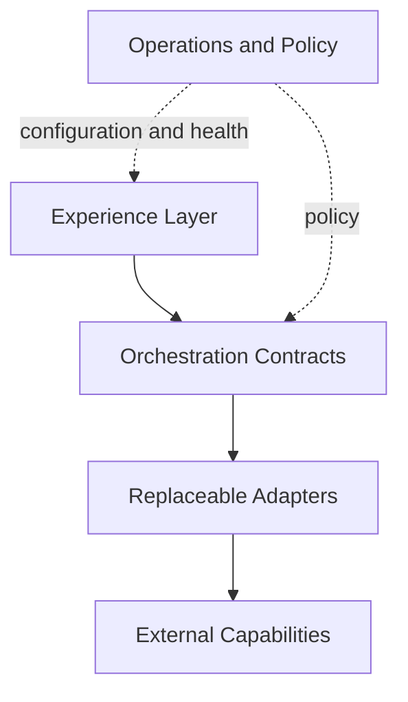

# Architecture Overview

## Purpose

Dialog Live coordinates several independently changing concerns: user input,
conversation state, controlled knowledge, generated speech, visual presentation,
configuration, and operations.

The architectural goal is not simply to connect AI APIs. It is to create a
coherent, interruptible, supportable experience while keeping protected
capabilities outside the public runtime.

## Conceptual Boundaries

| Boundary | Responsibility | Deliberately omitted |
| --- | --- | --- |
| Experience | Capture intent and present state | UI state machine and media code |
| Speech | Normalize voice input | Providers, models, formats, and tuning |
| Orchestration | Coordinate context and capabilities | Prompts and decision logic |
| Knowledge | Expose approved information | Indexing, retrieval, and data model |
| Voice | Produce presentation-ready speech | Providers and normalization rules |
| Visual runtime | Present a responsive character | Rendering and synchronization |
| Management | Configure and operate installations | Admin APIs and authorization |

## Dependency Direction

Core orchestration depends on contracts rather than provider-specific clients.
External systems are treated as replaceable adapters. The user-facing runtime
receives only the configuration and capabilities required for its role.

## What This Diagram Does Not Show

- Production service topology
- Network trust boundaries
- Authentication and licensing mechanisms
- Concrete data stores or schemas
- Provider selection and fallback rules
- Internal event formats
- Media synchronization techniques
- Performance parameters
- Deployment or update workflows

Those omissions are intentional. The diagram communicates system-design
responsibilities without exposing an implementation blueprint.
