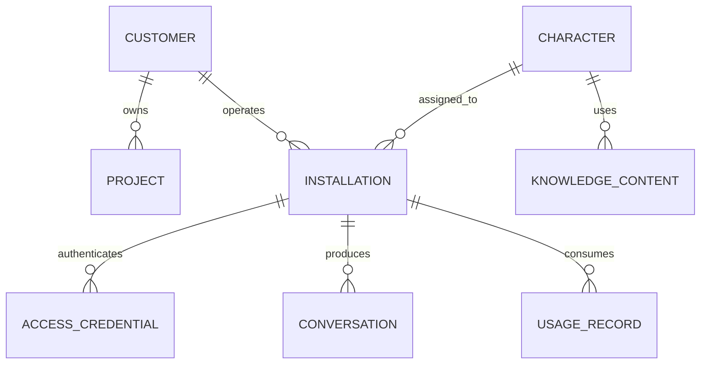

# Data And Observability

Dialog Live records structured operational information so installations can be
supported, usage can be attributed correctly, and failures can be diagnosed.

This document describes data categories, not the production schema.

## Conceptual Data Model

## Customer And Installation Data

Customer records represent organizations. Project and character labels identify
the experience being delivered. Installation records represent individual
kiosks and carry their own lifecycle state.

Keeping these identities separate supports:

- Multiple experiences for one customer
- Multiple kiosks for one character
- Independent suspension and expiration
- Correct cost and usage attribution
- Precise cleanup without deleting unrelated customer data

## Conversation Logs

Conversation records provide a support and product-usage trail. At a conceptual
level, a log can include:

- Customer and project attribution
- Character and installation attribution
- Session identifier
- Model and capability metadata
- Voice profile metadata
- Timing and creation information
- Non-sensitive operational context

Requests made by Studio's development test are explicitly marked and excluded
from customer conversation logging.

## Usage Records

Usage is recorded separately from conversation history. This allows operations
to detect cases such as:

- Requests are reaching the managed service
- Usage is increasing
- Conversation insertion has stopped
- A logging dependency is misconfigured

Separating these signals makes failures easier to isolate than relying on one
table or one success indicator.

## Knowledge Data

Approved knowledge is scoped to both customer and character. This prevents two
characters belonging to the same customer from accidentally sharing content
that was intended for only one experience.

Cleanup uses the same scope so removing one character does not delete the
customer's unrelated knowledge.

## Health Diagnostics

Health endpoints expose operational state such as:

- Whether conversation logging is active
- Why logging may be disabled
- The last insertion error
- The last successful insertion time
- Successful insertion count
- Whether required service configuration is present
- Runtime and dependency readiness

These diagnostics help distinguish an application problem from a credential,
database, logging, or external-service problem.

## Access Control

Sensitive operational tables are protected for server-side administration.
Public or distributed clients cannot query customer, installation, credential,
usage, conversation, or knowledge data directly.

Runtime authorization goes through a controlled validation operation. Managed
services use privileged server credentials; kiosk packages do not.

## Privacy And Logging Boundaries

The logging design avoids:

- Provider credentials
- Installation secrets
- Administrative tokens
- Internal prompts
- Source files
- Unnecessary customer configuration

The portfolio repository contains no real logs, identifiers, schema migrations,
or customer records.
