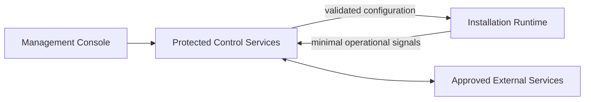

# Deployment Considerations

Interactive installations differ from conventional websites: they may run
unattended, depend on local media hardware, operate on constrained networks, and
need predictable recovery.

## Design Concerns

- Minimal secrets and protected logic on distributed clients
- Repeatable environment and character configuration
- Clear health checks for independently failing subsystems
- Safe updates with a recoverable previous state
- Remote policy without exposing administration credentials
- Hardware-aware resource validation
- Useful logs that avoid customer content and sensitive configuration
- Explicit ownership of local, managed, and external dependencies

## Conceptual Deployment Shape

This view intentionally omits hosting providers, endpoints, credentials,
packaging, release automation, and network configuration.
