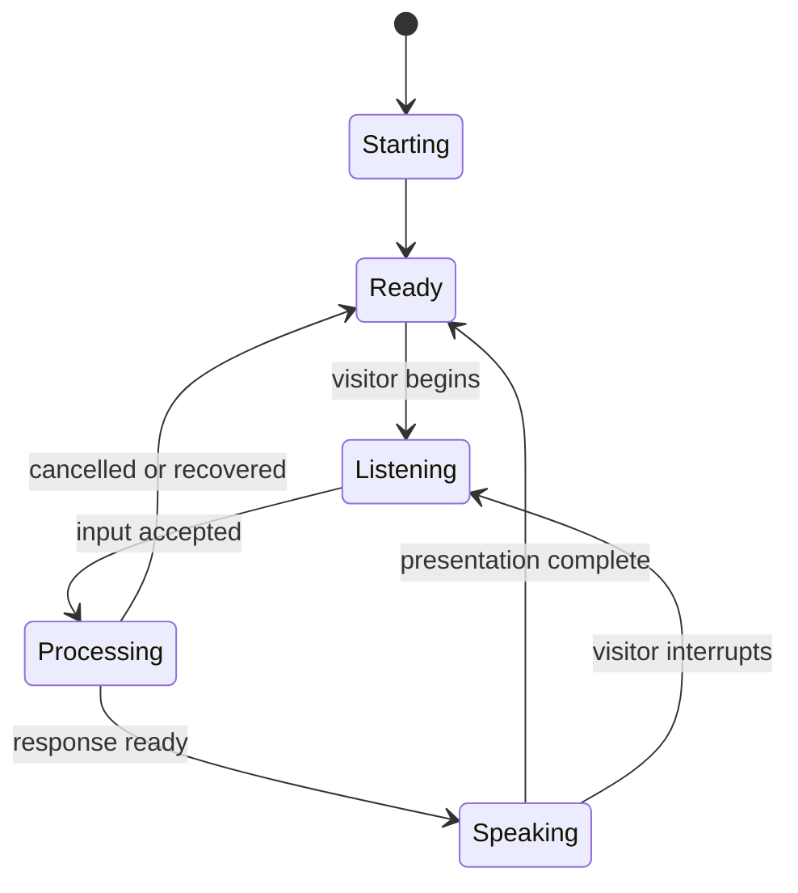

# Dialog Live Runtime

Dialog Live is the application a visitor sees and hears. Its job is to hide the
complexity of several services behind one coherent character interaction.

## Runtime Responsibilities

The application:

- Loads the selected character and its visual configuration
- Captures visitor audio on an explicit interaction
- Sends the request to the configured conversation service
- Presents listening and processing feedback
- Receives generated speech
- Coordinates speech playback with realtime character animation
- Handles interruption and cancellation
- Returns smoothly to the idle experience
- Reports startup and service failures in an actionable way

## Interaction Lifecycle

The production runtime includes more detailed states and events. This diagram
shows the product behavior, not the internal implementation.

## Realtime Coordination

Generated audio and generated visuals do not necessarily become available at
the same moment. The runtime therefore coordinates:

- Minimum readiness before presentation begins
- Audio playback and visual progression
- Transitions between idle, listening, and speaking media
- Completion after the final generated media has been presented
- Cancellation of work already in progress
- Recovery when a dependency stops responding

The exact buffering, synchronization, rendering, and timing mechanisms are
commercial implementation details.

## Character Runtime

Characters are configuration-driven. A runtime can select a character at
startup and load the appropriate:

- Identity and display settings
- Idle, listening, and speaking assets
- Visual keying and presentation settings
- Conversation destination
- Local or managed deployment profile

This avoids maintaining a separate application fork for every character.

## Desktop And Kiosk Operation

The runtime is packaged as a desktop kiosk application. It coordinates startup
of required local components, focuses the visitor experience, hides operating
system distractions, and supports unattended use.

Production concerns include:

- Startup ordering and readiness
- Local hardware validation
- Full-screen presentation
- Update scheduling
- External media-runtime discovery
- Clear error messages when required assets are missing
- Recovery after interrupted startup or dependency failure

## Performance Work

The realtime media path was measured and optimized across:

- Frame preparation
- Region-specific compositing
- Image resizing and encoding
- Transport payload size
- Browser rendering
- GPU memory and throughput
- Perceived transition latency

Performance decisions were evaluated end to end on target hardware. Exact
parameters and optimization code are intentionally excluded.

## Engineering Value

Dialog Live demonstrates:

- Realtime application state management
- Coordination across asynchronous AI and media services
- Browser media and GPU-oriented rendering work
- Cancellation and race-condition handling
- Configuration-driven product architecture
- Desktop packaging and kiosk reliability
- Diagnostics for a hardware-dependent production system
