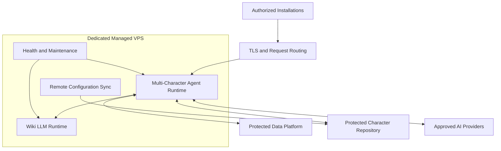

# Managed VPS Infrastructure

Dialog Live uses a dedicated VPS environment for the protected, remotely
managed part of the platform.

The VPS is not simply a place where one API is hosted. It is the operational
boundary between thin customer installations and the commercial platform's AI,
knowledge, authorization, data, and maintenance services.

## Why A Managed Server Layer

Shipping every service and credential inside each kiosk would make updates,
security, customer suspension, diagnostics, and support significantly harder.

The managed layer keeps:

- AI provider credentials
- Character brain configuration
- Agent orchestration
- Knowledge services
- Administrative database access
- Installation authorization
- Logging and usage attribution
- Maintenance operations

away from distributed client packages.

## Conceptual Service Layout

This diagram omits concrete hosts, ports, domains, credentials, network names,
and deployment commands.

## Multi-Character Agent Runtime

The managed conversation service can serve different character brains through
one protected runtime.

For an authorized request it conceptually:

1. Validates the installation.
2. Identifies the requested character.
3. Loads or refreshes that character's approved brain.
4. Runs speech recognition, agent reasoning, optional tools, and voice
   generation.
5. Attributes usage and conversation data to the installation.
6. Returns the audio response to the client.

A character can be refreshed independently so an update does not require every
other character to become unavailable.

## Wiki LLM Service

The knowledge runtime is deployed separately from the core agent service. This
keeps knowledge ingestion and search responsibilities distinct from the main
conversation lifecycle.

The agent accesses it through an internal service boundary and always includes
the intended customer and character scope.

## Authorization And Customer Control

Before protected AI services are used, the installation credential is validated
against managed customer and installation state.

The platform can enforce:

- Customer activation or suspension
- Individual kiosk activation or suspension
- Optional installation expiration
- Credential revocation
- Character assignment
- A controlled suspension message

These controls can change remotely without redistributing application secrets
or rebuilding the kiosk.

## Data And Logging

The VPS uses privileged server-side access for:

- Conversation logs
- Usage records
- Customer and installation validation
- Knowledge metadata
- Health diagnostics

Distributed installations never receive those administrative credentials.

## Deployment And Maintenance

The environment is containerized and connected through a secure public routing
layer.

Operational workflows support:

- Repeatable service deployment
- Updating the agent and knowledge runtimes
- Restarting services in a controlled way
- Health verification
- Selective character cleanup
- Remote configuration refresh
- Automated deployment from version-controlled workflows

Dialog Studio exposes the relevant publishing and maintenance actions as
separate operations so content updates, runtime deployments, client exports, and
resource deletion remain explicit.

## Reliability And Diagnostics

Health reporting covers more than whether a process is running. It helps
identify:

- AI runtime readiness
- Knowledge service availability
- Loaded character state
- Logging activation and last error
- Last successful conversation insertion
- Required configuration presence
- Runtime dependency and resource status

This is necessary for supporting unattended installations and diagnosing
problems without direct access to the kiosk.

## Engineering Value

The managed infrastructure demonstrates:

- Secure thin-client architecture
- Multi-character service hosting
- Containerized production operations
- Protected internal service communication
- Customer and installation authorization
- Remote configuration distribution
- Deployment automation and selective maintenance
- Operational diagnostics across AI, knowledge, and data services
