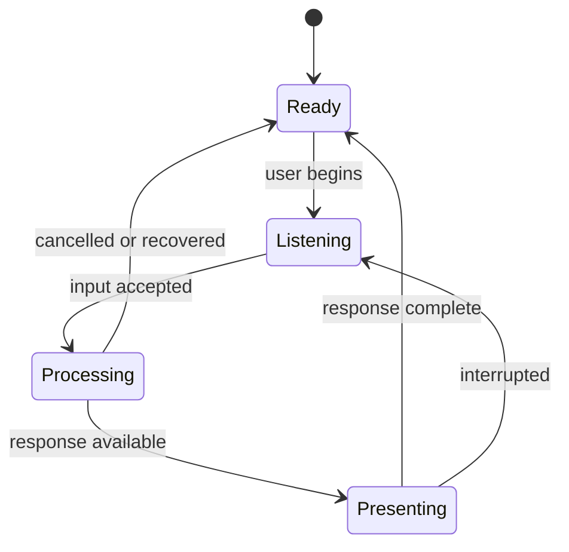

# Realtime Considerations

Realtime conversational media is a coordination problem across components with
different timing characteristics.

## Engineering Questions

- When does the interface communicate that input has been accepted?
- Which work can overlap, and which work is necessarily sequential?
- How does a new user action cancel work already in flight?
- What happens when audio is ready before visuals, or the reverse?
- How are state transitions kept visually coherent?
- Which metrics explain perceived latency rather than isolated service speed?
- How does the experience recover when one dependency becomes unavailable?

## Lifecycle Model

This lifecycle is conceptual. Production states, events, thresholds, buffering,
and synchronization behavior are intentionally excluded.

## Useful Operational Signals

- End-to-end response latency
- Time to first meaningful feedback
- Cancellation completion time
- Dependency error rate
- Recovery and fallback rate
- Presentation continuity
- Resource pressure under sustained use

No production metric names, alert thresholds, or telemetry schemas are included
in this showcase.
