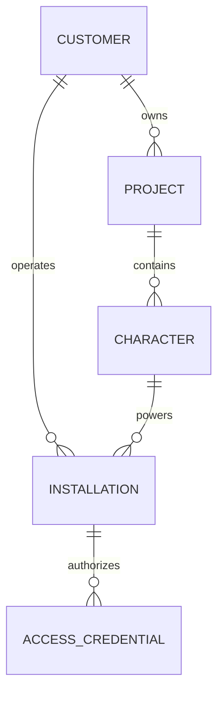

# Remote Platform

The remote platform allows Dialog Live installations to remain small and
controlled while protected AI configuration, credentials, and administration
stay on managed infrastructure.

## Remote Character Brains

Each character has its own AI configuration, referred to at product level as a
character brain.

A brain defines the approved behavior of one character:

- Character instructions
- Voice configuration
- Language-model preferences
- Optional knowledge and search capabilities
- Character-specific agent tools
- Logging attribution
- Fallback behavior
- Enabled or disabled status

Studio publishes approved brain changes to a protected configuration source.
The managed conversation service detects updates and refreshes the affected
character without requiring every client package to be rebuilt.

Character-specific behavior can be updated independently. Shared defaults can
be updated centrally where appropriate.

Changes to agent behavior and optional tool integrations can be refreshed for
the affected character without taking every other character offline.

The internal prompt format, loading mechanism, refresh strategy, and source
layout are not disclosed here.

## Customer Model

A customer can own multiple projects or character experiences. Customer
identity is therefore separate from project and character identity.

This conceptual model is deliberately simpler than the production database.

## Installation Control

Every delivered kiosk is represented as an individual installation. This makes
it possible to:

- Activate or suspend one customer
- Activate or suspend one kiosk without affecting others
- Associate an installation with the intended character
- Set an optional expiration
- Display a controlled suspension message
- Attribute requests and usage to the correct installation
- Revoke one credential while preserving the installation

Authorization is validated remotely. The distributed client does not receive
administrative database credentials.

## Credential Lifecycle

Installation credentials support:

- Human-readable descriptions
- Creation timestamps
- Explicit reuse of an existing active credential
- Creation of additional credentials when approved
- Independent revocation
- Audit-friendly association with an installation

Plain credentials are handled only inside controlled administration and build
workflows. They are not committed to source control.

## Thin Client Delivery

Managed client packages contain only what the kiosk needs to run the
experience. Protected AI services, provider credentials, administration logic,
and server-side configuration remain remote.

Benefits include:

- Smaller and safer customer packages
- Remote behavior updates without rebuilding the client
- Central credential rotation
- Central customer suspension
- Reduced exposure of proprietary technology
- Easier operational support

The protected services used by these clients run on dedicated managed VPS
infrastructure. This includes the multi-character agent runtime, Wiki LLM
service, authorization, logging, configuration refresh, and health operations.

## Remote Maintenance

The platform supports controlled maintenance actions for character resources,
runtime updates, and remote cleanup. Studio presents those actions as separate,
intentional operations so publishing a brain, updating the service, exporting a
client, and deleting resources are not confused with one another.

## Engineering Value

The remote platform demonstrates:

- Multi-customer system design
- Per-installation authorization
- Configuration distribution and selective refresh
- Secure client/server responsibility boundaries
- Credential lifecycle design
- Remote maintenance and delivery workflows
- Operational thinking beyond the local application
