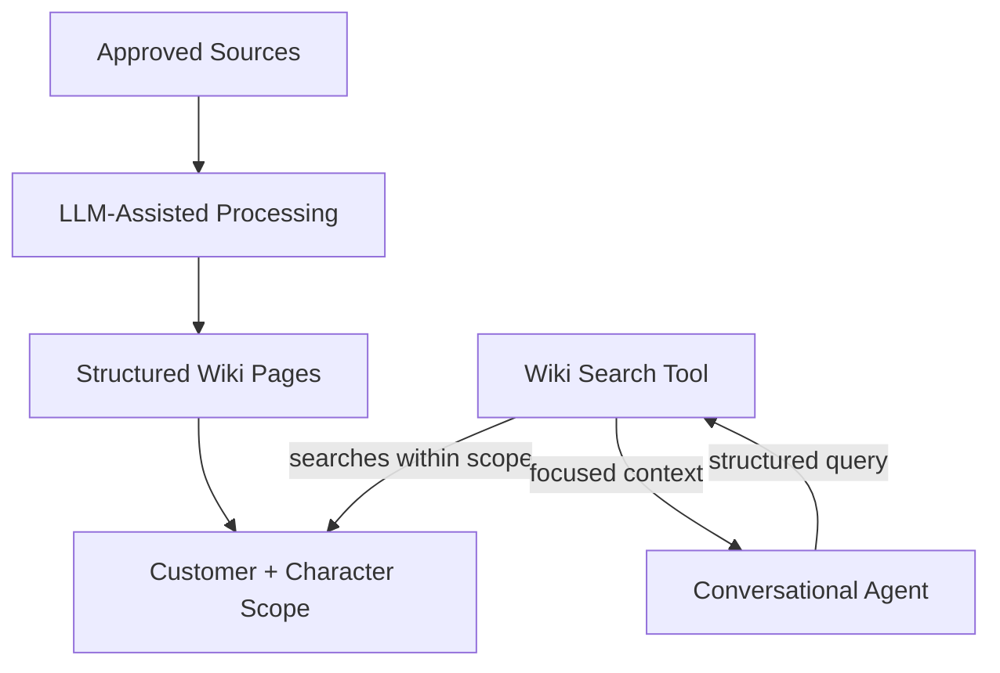

# Wiki LLM Knowledge Memory

Wiki LLM is Dialog Live's custom persistent knowledge layer for conversational
characters.

It replaces an earlier traditional RAG approach that relied more directly on
retrieving isolated source fragments. The change was driven by the needs of
realtime, spoken, multi-customer experiences.

## Why Traditional RAG Was Not Enough

Chunk-based retrieval is useful, but it can produce:

- Fragments without enough surrounding context
- Several similar chunks that repeat the same information
- Relevant words without the best narrative answer
- Source formatting that is awkward for spoken conversation
- Difficult content maintenance across customers and characters

For a realtime character, retrieval quality is not only about finding a
matching passage. The returned knowledge must help the agent answer coherently,
briefly, and naturally.

## The Wiki LLM Approach

Approved source material is transformed into a topic-oriented knowledge space
for the intended character.

At a conceptual level, the process is:

1. Approved source material is associated with a customer and character.
2. The content is processed into coherent, topic-oriented wiki pages.
3. The pages are stored with the same customer and character ownership.
4. During a conversation, the agent decides whether knowledge is required.
5. The agent calls the Wiki LLM search tool with a structured request.
6. The tool searches only the current character's approved wiki.
7. Focused context is returned to the agent for the final spoken answer.

The production generation prompts, ranking logic, schemas, and search
implementation are proprietary.

## Two Different Kinds Of Memory

Dialog Live deliberately separates:

| Memory type | Purpose | Lifetime |
| --- | --- | --- |
| Session memory | Preserve recent conversation context | One visitor session |
| Wiki LLM memory | Preserve approved character knowledge | Persistent and managed |

Session memory helps with follow-up questions such as "and when did that
happen?" Wiki LLM memory helps the character know the approved subject matter
behind the answer.

## Multi-Customer Isolation

Knowledge is not scoped only to a customer. It is scoped to both customer and
character.

This matters because one organization may operate multiple characters with
different:

- Subject areas
- Source material
- Editorial rules
- Allowed answers
- Update schedules

Search, updates, and deletion preserve that scope. Removing one character's
knowledge does not remove unrelated content belonging to the same customer.

## Designed For Realtime Conversation

Wiki LLM is optimized around the needs of the interaction:

- Return focused context rather than entire documents
- Favor coherent subject knowledge over disconnected fragments
- Keep the agent response pipeline bounded
- Support natural spoken answers
- Avoid loading every source into every prompt
- Keep retrieval behind an optional agent tool

The agent calls the knowledge layer only when the current question needs it.
General conversation does not pay the same retrieval cost.

## Content Lifecycle

Dialog Studio and the knowledge service support a controlled lifecycle:

- Associate sources with the correct customer and character
- Process new or updated source material
- Inspect and manage generated knowledge
- Search through the same boundary used by the agent
- Remove only the selected character's sources and pages
- Keep administrative access outside distributed clients

## Engineering Value

Wiki LLM demonstrates:

- Moving beyond generic RAG patterns when the product context requires it
- LLM-assisted knowledge organization
- Agent-accessible retrieval through a dedicated tool
- Multi-tenant and per-character data isolation
- Persistent knowledge lifecycle management
- Realtime-oriented context selection
- Separation between conversational memory and domain knowledge
